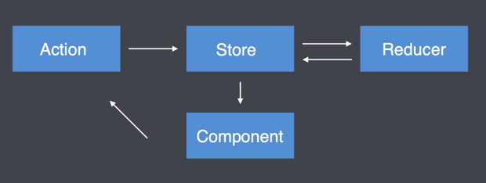
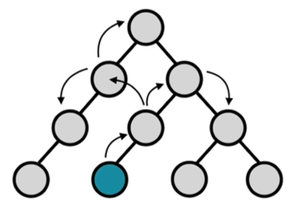
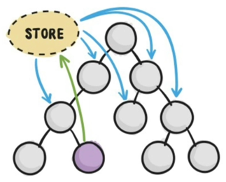
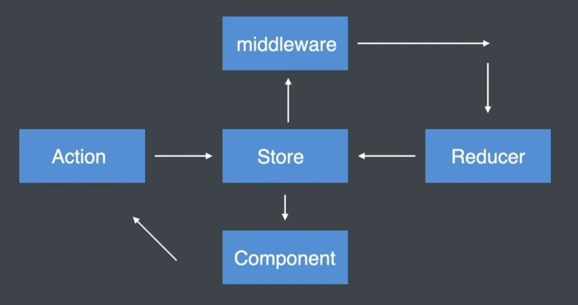

## Redux
`redux`  是一个 `JavaScript` 状态容器，提供可预测化的状态管理。
## 核心概念
`redux` 中主要是四个核心概念，他们之间的关系如下：

1. 组件通过 dispatch 方法触发 Action
2. Store 接收 Action 并将 Action 分发给 Reducer
3. Reducer 根据 Action 类型对状态进行更改并将更改后的状态返回给 Store 
4. 组件订阅了Store中的状态，Store中的状态更新会同步到组件

### store
存储状态的容器，是一个 `JavaScript` 对象。
### reducers
`reducer` 是一个函数，用来向 `store` 中存储或者更新状态。`reducer` 返回什么，`store` 中就存储什么。
### actions
`action` 是一个对象，对象内部必须要有一个 `type` 属性，用来标记一个操作，`type`属性的值是开发者自己定义的，用来描述对状态进行怎么样的操作。
### view
视图，也就是 `html` 页面。
## 工作流程
视图中的状态都来自 `store` 。如果视图需要更新状态，必须要先触发（dispatch） `action`，由 `action`  去执行`reducer`再提交相关的状态更新到 `store`，视图再拿到新的状态，这也是 `react` 单向数据流特征的体现。

`dispatch` 应是唯一改变 state 的方式。


## 使用
> 如果你的项目足够简单，你可能并不需要它
### 核心 API

```javascript

// 1、创建一个初始状态对象
const initialState = {
    count: 0
}

// 2、创建 reducer 函数
function reducer (state = initialState, action){
    switch (action.type){
        case 'increment': 
            return {
                count: state.count + 1
            }
        case 'decremet':
            return {
                count: state.count - 1
            }
        default:
            return state
    }
}

// 3、创建一个 store, store 需要传递一些参数
// - reducer
// - initialState
// - enhancer
const store = Redux.createStore(reducer)

// 获取 store 中的状态
store.getState()

// 4、定义 action
const increment = {
    type: 'increment'
}
const decrement = {
    type: 'decrement'
}

// 5、触发action 分发事件
store.dispatch(increment)
store.dispatch(decrement)


// 6、订阅 store, 当 state 中的数据发生改变之后，会运行订阅 store 时传入的函数
store.subscribe(() => {
    console.log(store.getState())
})
```

当 `store`  被创建的时候，会触发一次默认的 `action` ，用来存储初始状态。


## 解决了什么问题

在React中组件通信的数据流是单向的, 顶层组件可以通过props属性向下层组件传递数据,
而下层 组件不能向上层组件传递数据, 要实现下层组件修改数据, 需要上层组件传递修改数据
的方法到下层 组件. 当项目越来越大的时候, 组件之间传递数据变得越来越困难.



使用Redux管理数据，由于Store独立于组件，使得数据管理独立于组件，解决了组件与组件之间传递数据困难的问题。




## 与 React 结合

与 `react`  结合 需要安装 `react-redux redux`  这两个包。使用方式如下：

```javascript

```

### Provider
在外层用 Provider 包裹，并提供 store 属性
### connect
1、`connect` 可以代理订阅 `store` ，`store`  中的状态发生改变的时候，会重新渲染组件
2、`connect` 可以将 `store`  中的状态映射到 `props`  上
3、`connect` 之后可以拿到 `dispatch`  方法

#### 映射 props 和 dispatch

将 store 中的状态和 dispatch 映射给组件的时候，需要定义属性映射的规则，具体方式如下：

```javascript
const mapStateToProps = state => ({
    count: state.count
})

const mapDispatchToProps = disptach => ({
    increment(){
        disptach({ type: 'increment' })
    },
    decrement(){
        disptach({ type: 'decrement' })
    }
})

export default connect(mapStateToProps, mapDispatchToProps)(Counter)
```


## redux 案例

借助 `bindActionCreators` 以及 `combineReducers` 根据模块拆分 `store` 

[这里查看详细代码](https://github.com/Veycn/redux-demo/tree/master/src/store)


[Redux 文档](https://www.redux.org.cn/docs/recipes/reducers/PrerequisiteConcepts.html)


## 中间件
中间件允许我们扩展 redux 程序。在之前，action 被触发以后，会交给 reducer 处理状态的变更。加入了中间件之后的 redux 处理流程是这样的：



### 如何编写中间件

Redux 中间件本质上是一个 `科里化的函数`。

编写中间件需要注意当一个中间件的逻辑结束一定要调用 `next(action)` 

```javascript
// 中间件模板
export default store => next => actions => {}

// 按照模板，写一个 logger 中间件
export default store => next => actions => {
    // 中间件逻辑
    console.log(store)
    console.log(action)
    // 最后调用 next，把 action 传递进去，执行下一个中间件或者交给 reducer
    next(action)
}
```

### 注册使用

```javascript
import {createStore, applyMiddleware} from "redux";

import rootReducer from "./reducers/root.reducer";

import Logger from './middleware/logger'
import Test from "./middleware/test";

export const store = createStore(rootReducer, applyMiddleware(Logger, Test))
```

中间件会按照注册的顺序依次执行。


### redux-thunk

```javascript
export default (store) => next => action => {
    // 只关心执行的是不是异步操作
    // 同步操作 action 是一个对象
    // 异步操作 action 则是一个 函数，把异步操作写在函数中，传递进来

    if (typeof action === 'function'){
        return action(store.dispatch)
    }
    next(action)
}
```
这样就完成了一个可以进行异步操作的中间件。当 `action`  为同步事件的时候，
传递过来一个 `action`  对象，此时在这个中间件不做任何处理，直接交给`next` 。
如果是一个函数，则表示是一个异步操作，将 `dispatch`  的权限交给这个函数，
然后等异步事件拿到结果之后，在这个函数中 `dispatch`  相关的修改状态的 `action` 。


[redux-thunk 真就这么三四行代码](https://github.com/reduxjs/redux-thunk/blob/master/src/index.ts)

usage: 
```javascript
const loadPost = () => async dispatch => {
    const posts = await axios.get('/posts').then(res => res.data)
    dispatch({type: 'LOAD_POSTS_SUCCESS', payload: posts})
}
```

## redux-saga

`redux-saga`  可以将异步操作从 `Action Creator` 文件中抽离出来，放在一个单独的文件中.

### 使用
```javascript
// index.js  引入 saga
import createSagaMiddleware from 'redux-saga'
const sagaMiddleware = createSagaMiddleware()
export const store = createStore(rootReducer, applyMiddleware(sagaMiddleware))

// 启用 counterSaga
import CounterSaga from "./sagas/counter.saga";
sagaMiddlewar.run(CounterSaga)


// counter.saga.js 为 counter 组件定义 saga 异步行为

// takeEvery 接收 action
// put 触发 action
import {delay, put, takeEvery} from 'redux-saga/effects'
import {increment} from "../actions/counter.action";
import {INCREMENT_ASYNC} from "../const/counter.const";

// 异步函数，模拟异步操作
function* increment_async_fn(action) {
    // 延迟两秒， saga 中不支持 setTimeout
    yield delay(2000)
    // 执行同步 action
    yield put(increment(action.payload))
}

// saga 要求导出一个 generator 函数， 在 index.js 中使用
export default function* CounterSaga() {
    /**
     * @string action 类型字符串
     * @function 异步操作函数
     */
    yield takeEvery(INCREMENT_ASYNC, increment_async_fn)
}


```

### 文件拆分与合并
```javascript
// root.saga.js
import {all} from 'redux-saga/effects'
import CounterSaga from "./counter.saga";
import ModalSaga from "./modal.saga";

export default function* rootSaga() {
    yield all([
        CounterSaga(),
        ModalSaga()
    ])
}

// index.js

import createSagaMiddleware from 'redux-saga'
import rootSaga from "./sagas/root.saga";

const sagaMiddleware = createSagaMiddleware()
export const store = createStore(rootReducer, applyMiddleware(sagaMiddleware))

sagaMiddleware.run(rootSaga)
```
